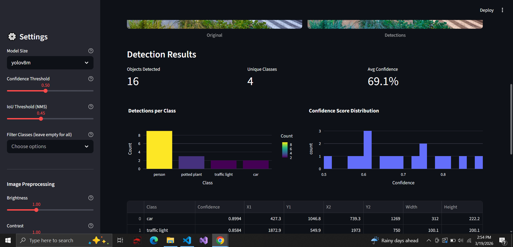

# 🔍 Real-Time Object Detection with YOLOv8

A full-featured web application that detects objects in images, batch uploads, video, and webcam feeds using YOLOv8. Built with Streamlit and deployed on HuggingFace Spaces.

> **🌐 [Try the Live Demo →](https://huggingface.co/spaces/YOUR_USERNAME/yolo-detector)**
>
> **💡 [View the Interactive Explanation →](https://htmlpreview.github.io/?https://github.com/GamithaManawadu/yolo-detector/blob/main/Explanations/yolo-app-explained.html)**

<p align="center">
  
  
</p>

## How It Works

YOLOv8 (You Only Look Once, version 8) processes the entire image in a single forward pass through a neural network, predicting bounding boxes and class probabilities simultaneously. Unlike older approaches that used sliding windows or region proposals, YOLO is fast enough for real-time detection. The model is pre-trained on the COCO dataset which covers 80 common object classes including people, vehicles, animals, furniture, electronics, and more.

## Features

The app supports four input modes through a tabbed interface. The **Single Image** tab lets users upload one image or try a sample, showing the original alongside the annotated result with bounding boxes, summary metrics (objects detected, unique classes, average confidence), interactive Plotly charts (detections per class, confidence distribution), and export buttons for CSV, JSON, and annotated PNG. The **Batch Images** tab accepts multiple uploads at once, runs detection on each, then produces aggregate charts and a combined CSV download. The **Video** tab processes uploaded MP4/AVI/MOV files frame-by-frame with optional object tracking that assigns persistent IDs across frames, generates a detections-over-time line chart, and outputs an annotated video download. The **Webcam** tab captures a photo directly from the browser camera for instant detection.

The sidebar provides extensive controls. Users can select from five YOLOv8 model sizes (nano through xlarge), adjust the confidence threshold and IoU threshold for non-maximum suppression, filter detections to specific object classes, and tune image preprocessing settings (brightness, contrast, sharpness) to improve detection on poor-quality uploads. A detection heatmap mode replaces bounding boxes with a confidence-weighted density overlay smoothed by a Gaussian filter, useful for understanding spatial concentration of detected objects.

## Model Variants

| Model   | Parameters | Speed   | Best For                                    |
| ------- | ---------- | ------- | ------------------------------------------- |
| YOLOv8n | 3.2M       | Fastest | Real-time, mobile, demos                    |
| YOLOv8s | 11.2M      | Fast    | Balanced speed and accuracy                 |
| YOLOv8m | 25.9M      | Medium  | Higher accuracy when speed is less critical |
| YOLOv8l | 43.7M      | Slower  | Precision-critical tasks                    |
| YOLOv8x | 68.2M      | Slowest | Maximum accuracy                            |

## App Architecture

The application is structured around a reusable `run_detection_and_display()` function that handles the full pipeline from preprocessing through detection, display, charting, and export. This function is shared across the single image, batch, and webcam tabs following the DRY principle. The YOLO model is loaded once using Streamlit's `@st.cache_resource` decorator, preventing redundant 2–3 second reloads on every user interaction. Detection results are structured as Pandas DataFrames via `build_detections_df()`, enabling filtering by class, interactive display, and multi-format export. Video processing uses OpenCV for frame-by-frame reading and writing, with YOLO's built-in `model.track()` for persistent object tracking across frames.

## Tech Stack

| Library              | Role                | Why                                                        |
| -------------------- | ------------------- | ---------------------------------------------------------- |
| Streamlit            | Web framework       | Build interactive ML apps in pure Python, no frontend code |
| Ultralytics (YOLOv8) | Object detection    | State-of-the-art detection with easy API and tracking      |
| OpenCV               | Video processing    | Read/write video frames, colour conversion, heatmap        |
| PIL (Pillow)         | Image preprocessing | Brightness, contrast, sharpness adjustment                 |
| Plotly               | Interactive charts  | Hoverable, zoomable bar charts and histograms              |
| Pandas               | Data handling       | Structure detections for display, filtering, and export    |
| SciPy                | Heatmap smoothing   | Gaussian filter for smooth confidence density maps         |

## Run Locally

```bash
pip install -r requirements.txt
streamlit run app.py
```

## Project Structure

```
yolo-detector/
├── app.py               # Streamlit application
├── requirements.txt     # Dependencies
├── Explanations/
│   └── yolo-app-explained.html
├── README.md
└── images/
    ├── demo_screenshot.png
    └── detection_example.png
```

## Technologies

Streamlit, YOLOv8 (Ultralytics), OpenCV, PIL, Plotly, Pandas, SciPy, HuggingFace Spaces
