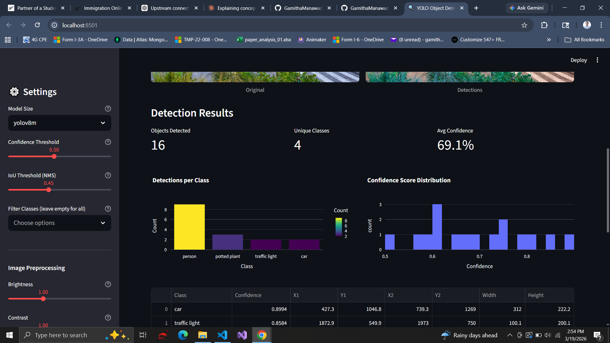

# 🔍 Real-Time Object Detection with YOLOv8

A web application that detects objects in uploaded images using YOLOv8, built with Streamlit and deployed on HuggingFace Spaces.

> **🌐 [Try the Live Demo →](https://huggingface.co/spaces/YOUR_USERNAME/yolo-detector)**

<p align="center">
  
  
</p>

## Features

The app allows users to upload any image and get instant object detection results. It supports three YOLOv8 model sizes (nano, small, medium) selectable from the sidebar, with adjustable confidence and IoU thresholds. Users can filter detections by specific object classes (e.g., show only "person" and "car"), view summary metrics (total objects, unique classes, average confidence), see per-class breakdowns, and download the annotated image with bounding boxes.

## How It Works

YOLOv8 (You Only Look Once, version 8) processes the entire image in a single forward pass through a neural network, predicting bounding boxes and class probabilities simultaneously. Unlike older approaches that used sliding windows or region proposals, YOLO is fast enough for real-time detection. The model is pre-trained on the COCO dataset which covers 80 common object classes including people, vehicles, animals, furniture, electronics, and more.

## Model Variants

| Model    | Parameters | Speed   | Best For                    |
| -------- | ---------- | ------- | --------------------------- |
| YOLOv8n  | 3.2M       | Fastest | Real-time, mobile, demos    |
| YOLOv8s  | 11.2M      | Fast    | Balanced speed and accuracy |
| YOLOv8m  | 25.9M      | Medium  | Higher accuracy when speed is less critical |

## Tech Stack

The application is built with Streamlit for the web interface, Ultralytics YOLOv8 for object detection, PIL/NumPy for image processing, and deployed on HuggingFace Spaces for free hosting with a shareable URL.

## Run Locally

```bash
pip install -r requirements.txt
streamlit run app.py
```

## Deploy to HuggingFace Spaces

1. Create an account at [huggingface.co](https://huggingface.co)
2. New Space → select **Streamlit** as the SDK
3. Upload `app.py` and `requirements.txt`
4. The app auto-builds and deploys in ~2 minutes
5. Share your URL: `https://huggingface.co/spaces/YOUR_USERNAME/yolo-detector`

## Project Structure

```
yolo-detector/
├── app.py               # Streamlit application
├── requirements.txt     # Dependencies
├── README.md
└── images/
    ├── demo_screenshot.png
    └── detection_example.png
```

## Technologies

Streamlit, YOLOv8 (Ultralytics), Python, PIL, NumPy, HuggingFace Spaces
